# 🧠 Python Django Portfolio Project


Welcome to **Aminul Islam's Professional Python & Django Portfolio**.  
This project demonstrates real-world Python logic, Django rendering, dynamic quizzes, comment integration, and beautiful UI — perfect for learning or showcasing to employers.

---

## 📸 Screenshots

| Sidebar Navigation | Content Pages | Interactive Views |
|--------------------|---------------|-------------------|
| 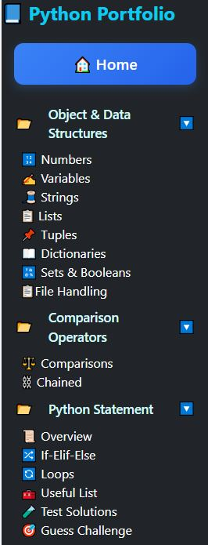 | 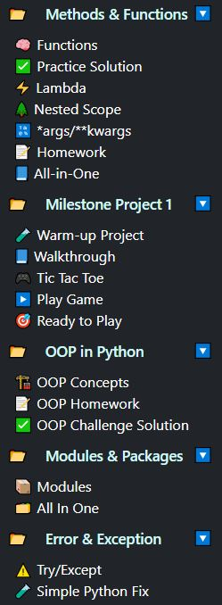 | 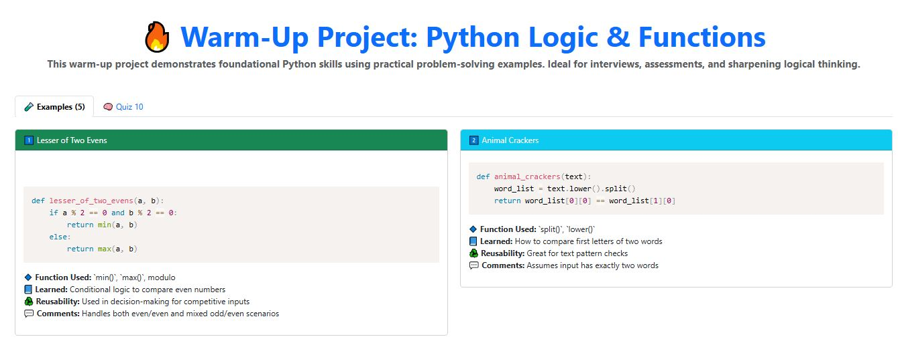 |
| 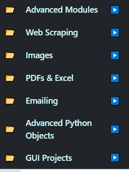 | 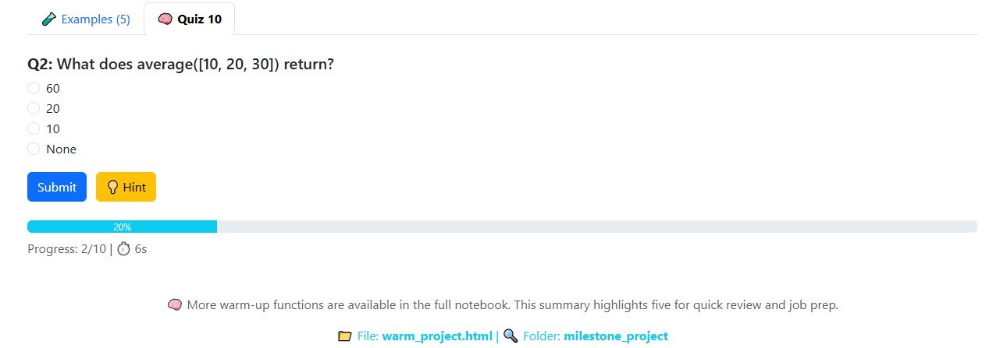 | 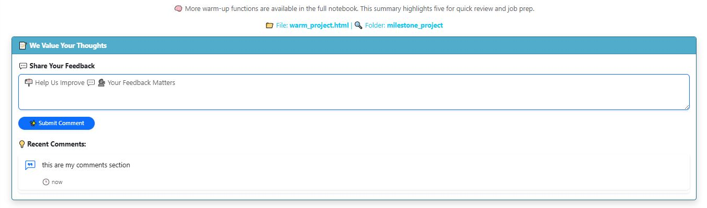 |
| 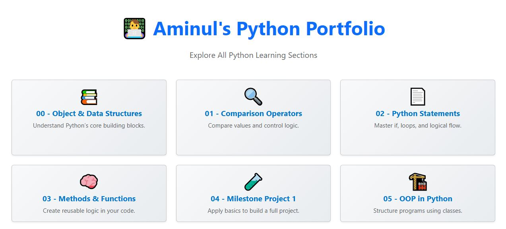 | 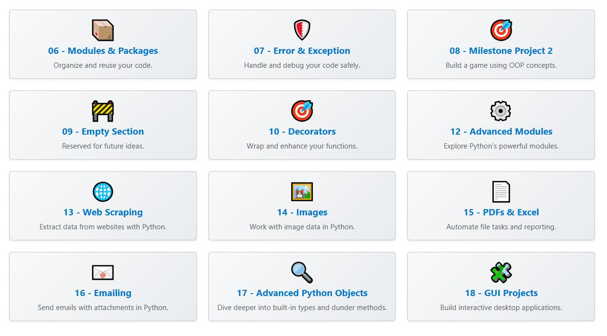 | 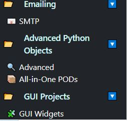 |

---

## 📜 Certifications

| Python Certificate | Django Certificate |
|--------------------|--------------------|
| 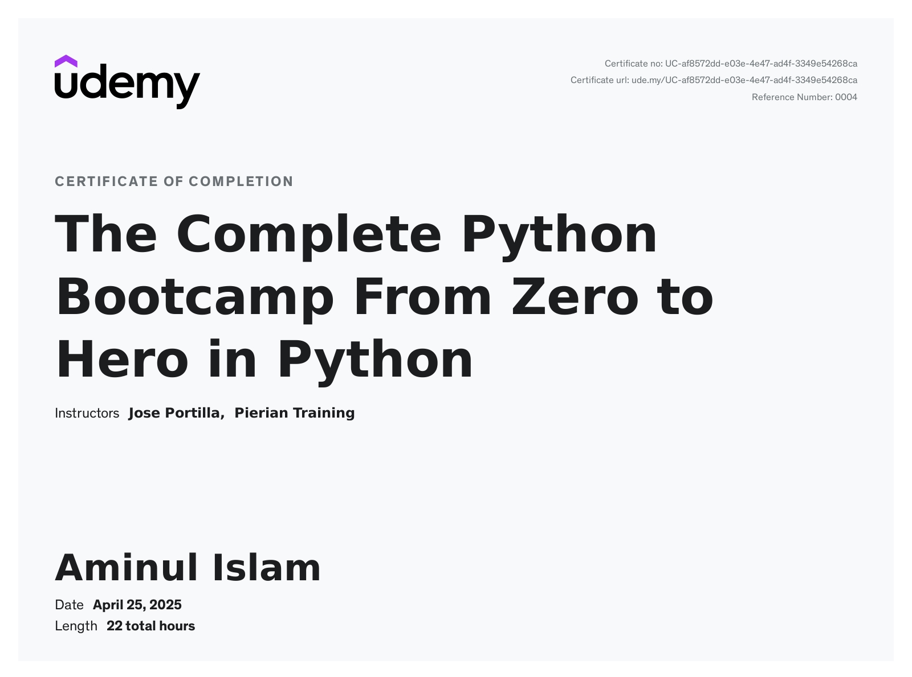 | 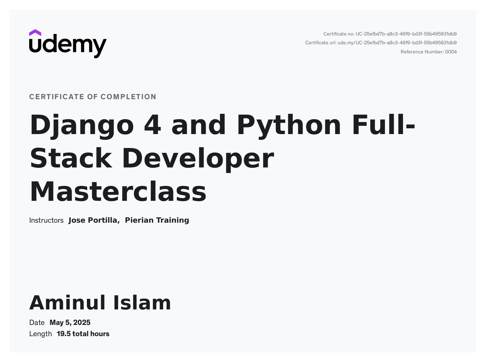 |

---

## 🚀 Key Features

- ✅ Real-world Python examples with inline explanation
- ✅ Interactive quizzes powered by JavaScript
- ✅ Dynamic comment submission per example
- ✅ Bootstrap 5-based responsive layout
- ✅ Sidebar navigation with collapsible folders
- ✅ Centralized quiz logic via shared JS
- ✅ GitHub-ready project structure

---

## 🛠 Tech Stack

- **Python 3**
- **Django 4**
- **HTML5, CSS3, Bootstrap 5**
- **JavaScript (Quiz Logic)**
- **SQLite 3**, Git & GitHub

---

## 🧪 Folder Structure

```bash
python-portfolio/
├── images/                  # UI & certificate screenshots
├── python_portfolio/        # Django app
│   ├── core/                # App logic, views, templates
│   ├── static/              # CSS/JS
│   ├── templates/           # HTML pages
│   ├── views.py, urls.py
├── requirements.txt
├── manage.py
└── README.md
